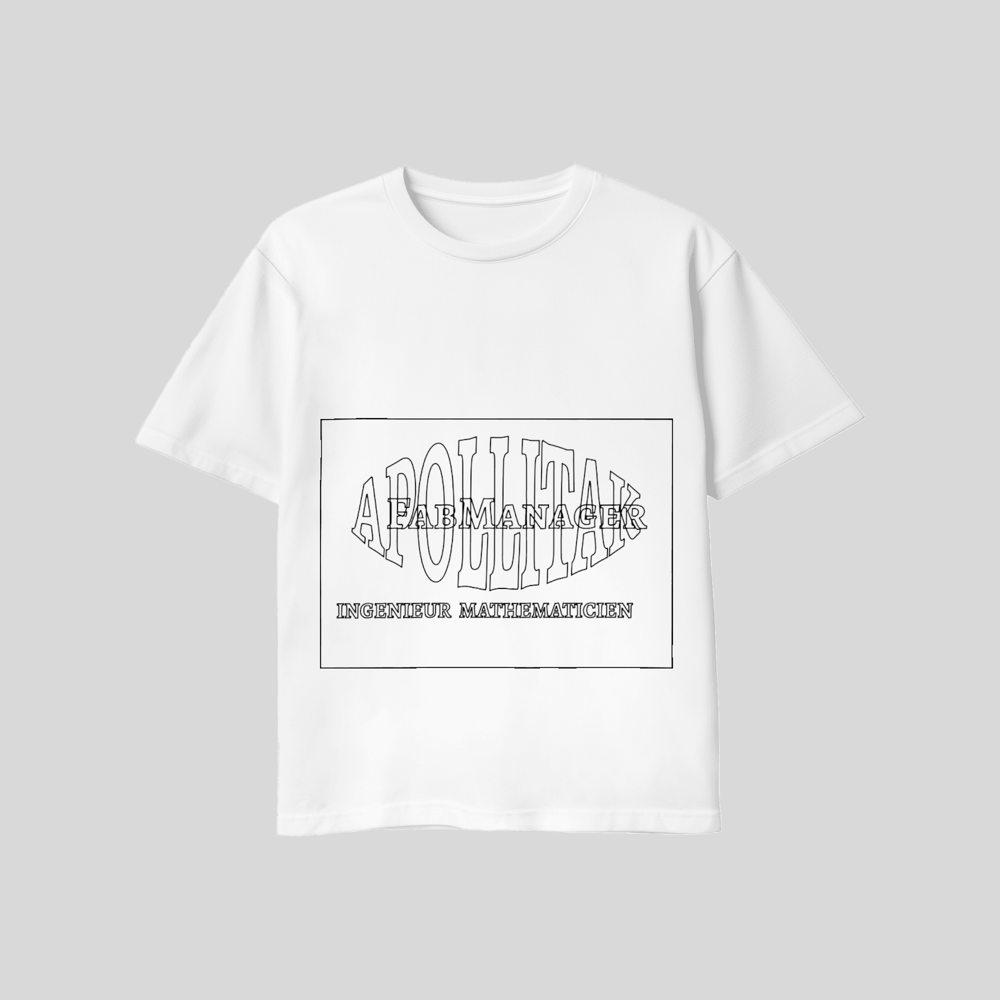

JOURNAL DU 01 SEPTEMBRE 2026 .

## 1. Fait aujourd'hui
- Conception d'une meme esquisse avec plusieurs options.
- conception d'une porte clé.

- Impression DTF avec XTool.

- Montage de circuit électronique avec la breadbord.

## 2. Appris
- Apprendre à faire une esquisse en utilisant plusieurs option dans fusion 360.
- Décomposer un corps en composant.
- Faire des autocollant dans XTool.
- Le fonctionnement de la breadbord.
## 3. Raté puis corrigé
-Difficulté avec faire une esquisse,assistance de mon collègue de meme banc,réussi.

## 4. Décidé
- Faire toujours un test à l'aide de la breadbord avant tout montage final.

## 5. À faire demain
- continuer la conception avec fusion 360,ipression DTF,electronique.

         Fait,à lomé le 01/09/2026

                TAKARA Appolinaire
