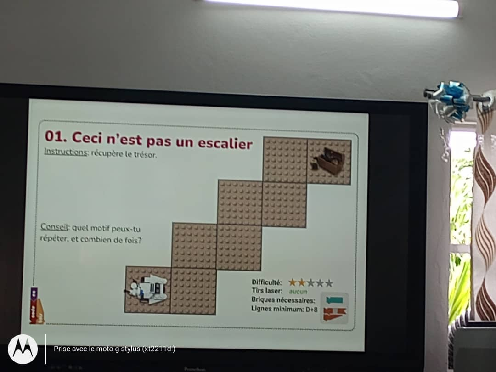
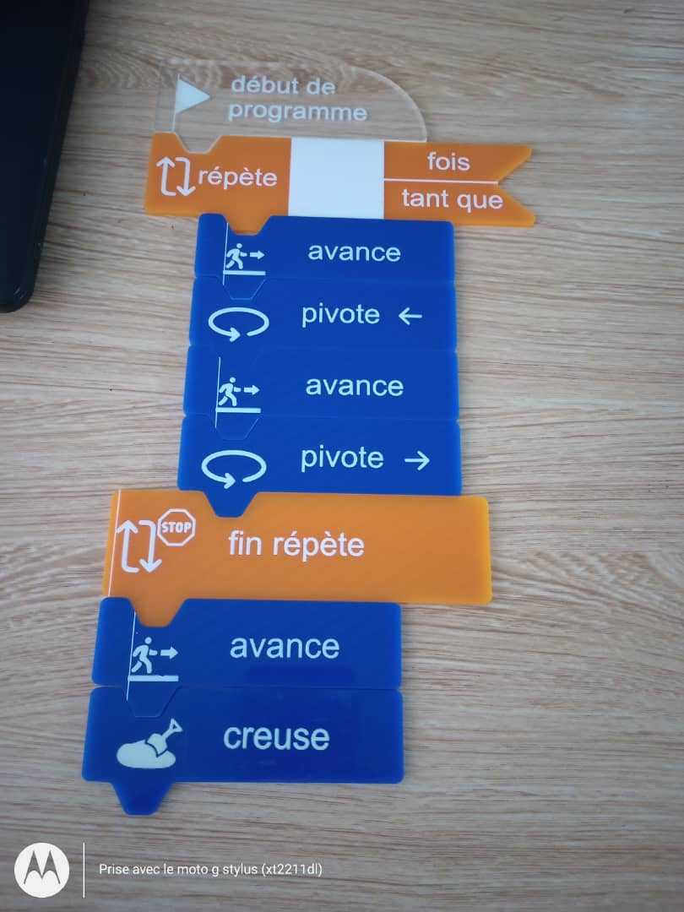
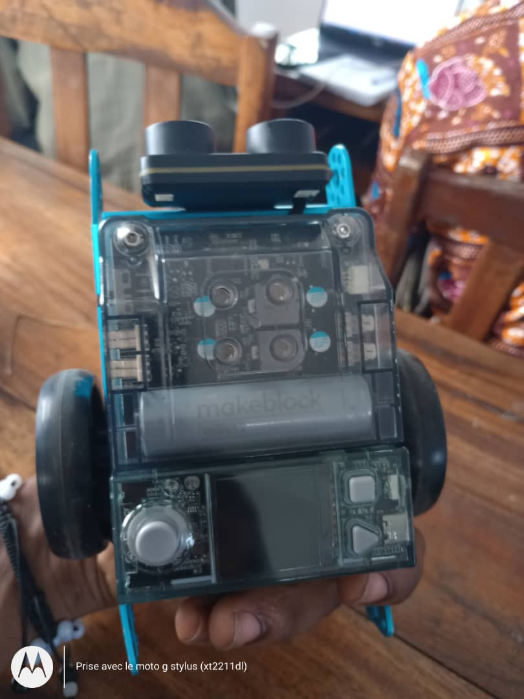

JOURNAL DU 02 SEPTEMBRE 2026 .

## 1. Fait aujourd'hui
- Realiser la version V0 de notre projet de robot éducatif programmable.
- Algorithmique débranché.

- Montage d'un robot et le faire marcher.

## 2. Appris
- Ecrire un algorithme à l'aide d'étiquette.
- Savoir monter un robot.
- programmer le robot à l'aide de la cyberpi avec mblock.
## 3. Raté puis corrigé
- Inverser les fils de connection ente les roues du robot.

## 4. Décidé
- Réprendre ces différentes notions à la maison.

## 5. À faire demain

         Fait,à lomé le 02/09/2026

                TAKARA Appolinaire
