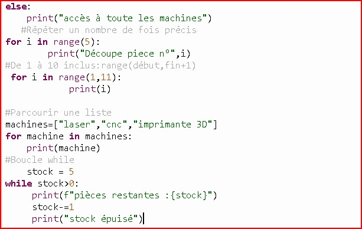

JOURNAL DU 04 SEPTEMBRE 2026.

## 1. Fait aujourd'hui
- Modélisation 3D 

- Le fonctionnement de la plaquette PCB.
- Les conditions if ,elif,else.
- écrire un script qui autorise ou refuse l'usage d'une machine selon la formation suivie.

- Les boucles for,while.

- Les Tuples et dictionnaires.

## 2. Appris
- Faire l'esquisse d'un objet complexe et parvenir à un objet complet.
- Maitrise des fonctions telles:la symétrie par miroir,l'extrusion,
- Le mode d'emploie des conditions:if,elif,else.
- La boucle for.
- La presence de deux points à la fin de chaque conditionnement.
- L'indexation en programmation commence toujours par 0.
- 
## 3. Raté puis corrigé
- Dificultés à réussir une esquisse,assintance du formateur,maintenant j'arrive à faire une esquisse.

## 4. Décidé

- Faire beaucoup d'exercices pour se familiariser sur la conception 3D.
## 5. À faire demain
continuité du programme de cours adopié.

         Fait,à lomé le 04/09/2026

                TAKARA Appolinaire
