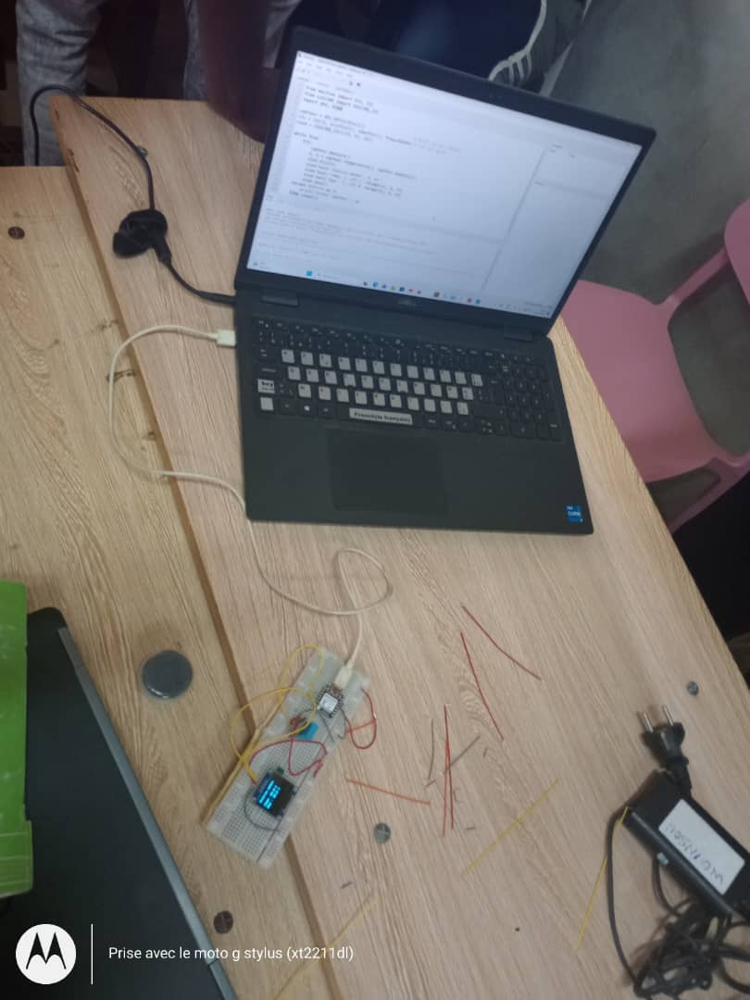
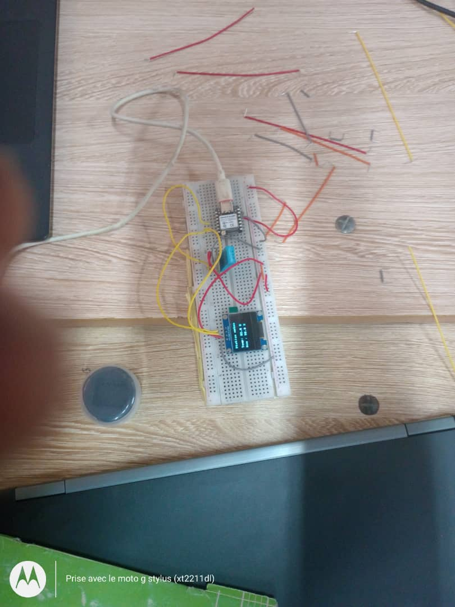
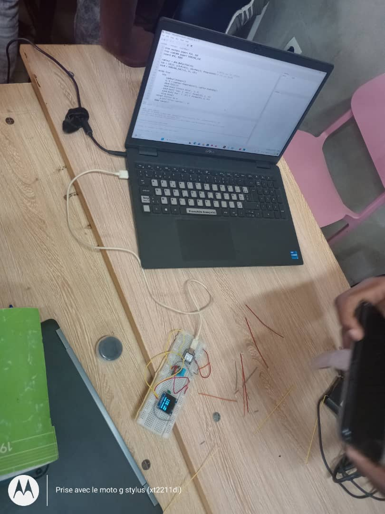

JOURNAL DU 05 SEPTEMBRE 2026.

## 1. Fait aujourd'hui
- Le TP sur le projet Météo ,impregner d'un capteur d'humidité,de température...

## 2. Appris
-   Faire un circuit avec la breadbord.

## 3. Raté puis corrigé

- Après le branchement et la connection avec micropython,le curquoi ne marche pas ,lier les deux plaques formée pour donnée la breadboard,le circuit marche enfin.
## 4. Décidé
- Chaque groupe devra faire les versions V0,V1 .

         Fait,à lomé le 05/09/2026

                TAKARA Appolinaire
