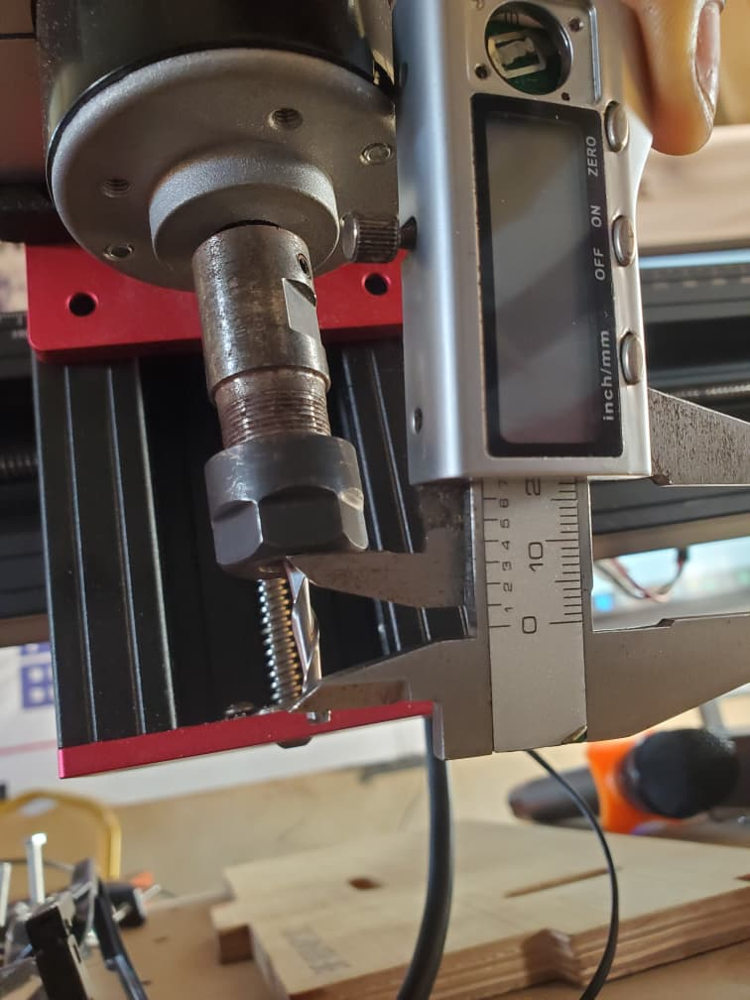
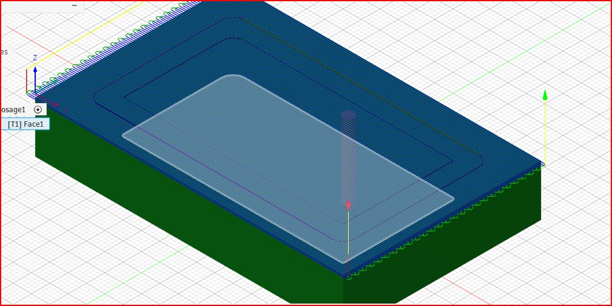
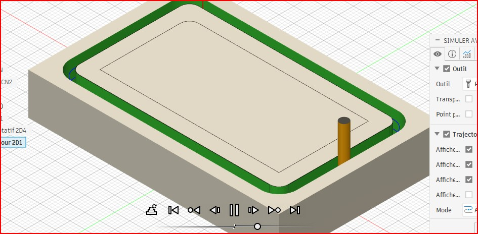
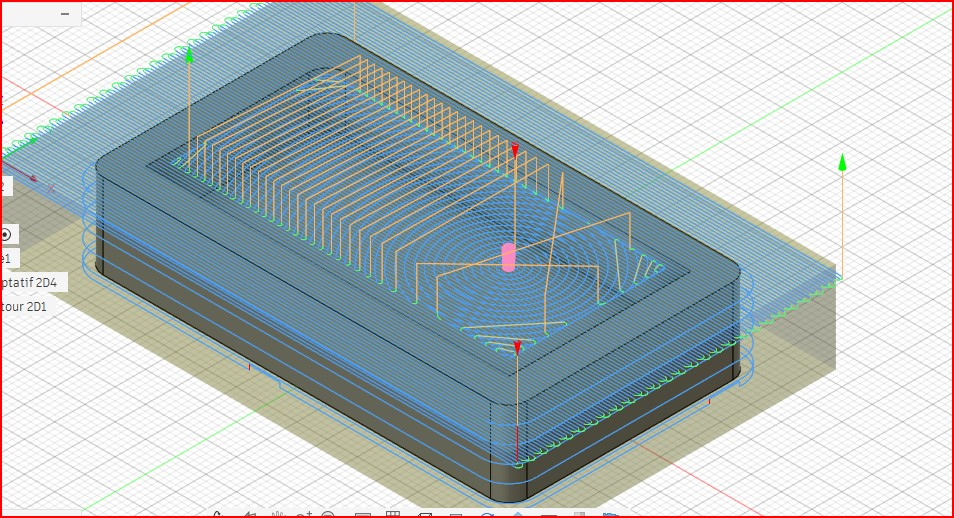
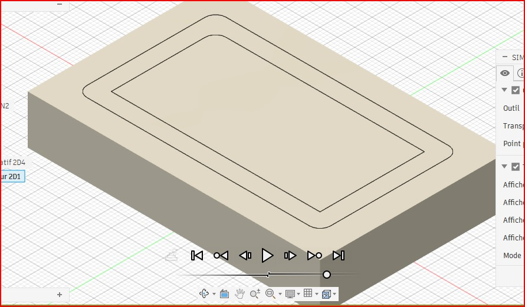

# JOURNAL DU 08 SEPTEMBRE 2026(  Rédiger par TAKARA Appolinaire Assankim)

# 1. Fait aujourd'hui
- Travailler sur les projets par les groupes de 4 personnes.
- Le cours intitulé:De la conception à la pièce usinée avec fusion 360.
- Aller du design,à la manufacture,jusqu'a usinée une pièce.

- Le flux de travail FAO dans fusion 360.
- Simulation dans fusion 360.

## 2. Appris
- La FAO relie la conception à la fabrication.

-Usiner une pièce.
Simuler l'usinage de l'objet dans fusion 360.

- Génerer le Gcode de l'objet à usiner.
## 3. Raté puis corrigé
- Difficulter à faire partir les traits de la procédure d'usinage.

- Assistance de la par du formateur puis correction.

## 4. Décidé
- Choisir moins de vitesse d'usinage pour obtenir un objet de qualité.

## 5. À faire demain
- Faire la FAO de l'objet paramètré obtenu

         Fait,à lomé le 08/09/2026

                
