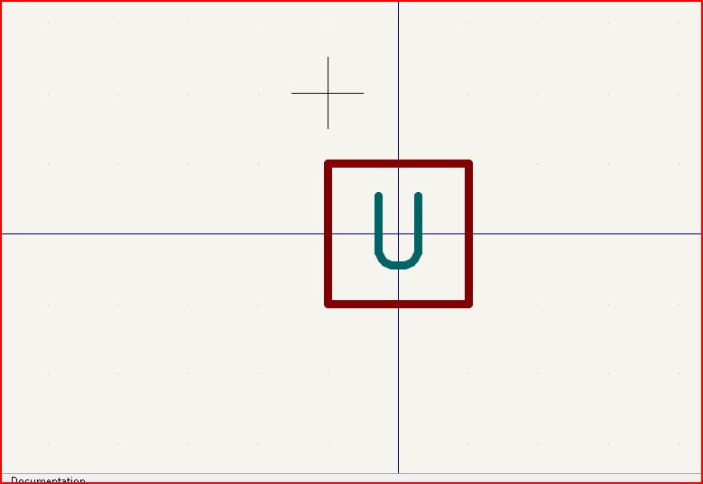
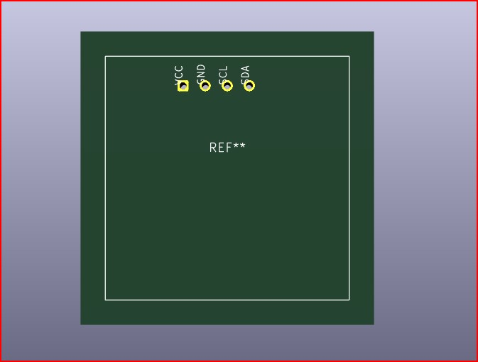
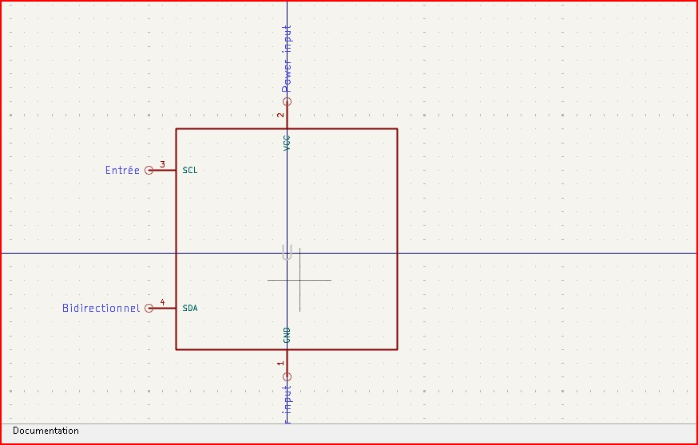

# JOURNAL DU 09 SEPTEMBRE 2026
**Rédigé par TAKARA Appolinaire Assankim**

## 1. Fait aujourd'hui

- Travail sur la conception du circuit imprimé (PCB) sous KiCad.

- Utilisation de l'outil **Assigner les empreintes** (Assign Footprints) pour associer chaque composant du schéma à son empreinte physique.
- Assignation des empreintes pour : condensateur (C1), LED (D1), résistances (R1, R2), et un connecteur (U2).

- Recherche de la bonne librairie pour un bouton poussoir 4 broches (`Button_Switch_THT`, empreinte type `SW_PUSH_6mm`).
- Vérification des composants déjà assignés (SW1, module XIAO Add-On en U1).

## 2. Appris

- La différence entre les librairies THT (traversant) et SMD (montage en surface), et l'importance de choisir la bonne selon le composant physique réel.
- Le flux de travail complet KiCad avant de pouvoir vérifier un circuit :
  1. Assigner toutes les empreintes dans le schéma
  2. Mettre à jour le PCB depuis le schéma
  3. Lancer le DRC (Design Rules Check) dans Pcbnew
- Le DRC permet de détecter les empreintes manquantes, les connexions non reliées et le non-respect des règles d'espacement.

## 3. Raté puis corrigé

- Confusion initiale sur la terminologie ("bouton ERC") — clarifiée : il s'agissait bien du bouton poussoir à assigner, pas de l'outil ERC (Electrical Rules Check) de KiCad.
- Recherche du bouton DRC : d'abord cherché dans l'éditeur de schéma, alors qu'il se trouve dans l'éditeur PCB (Pcbnew).

## 4. Décidé

- Vérifier physiquement (pied à coulisse ou datasheet) l'écartement réel des pattes des composants THT avant de valider définitivement les empreintes, pour éviter tout décalage au soudage.
- Respecter l'ordre de travail : assignation complète des empreintes → mise à jour PCB depuis schéma → DRC, avant de passer au placement des composants.

## 5. À faire demain

- Finaliser l'assignation des empreintes restantes.
- Lancer la mise à jour du PCB depuis le schéma.
- Exécuter le DRC et corriger les erreurs éventuelles.
- Commencer le placement des composants sur le PCB.
