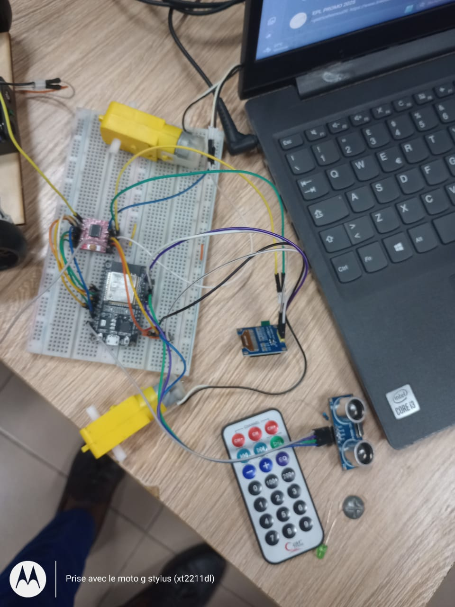
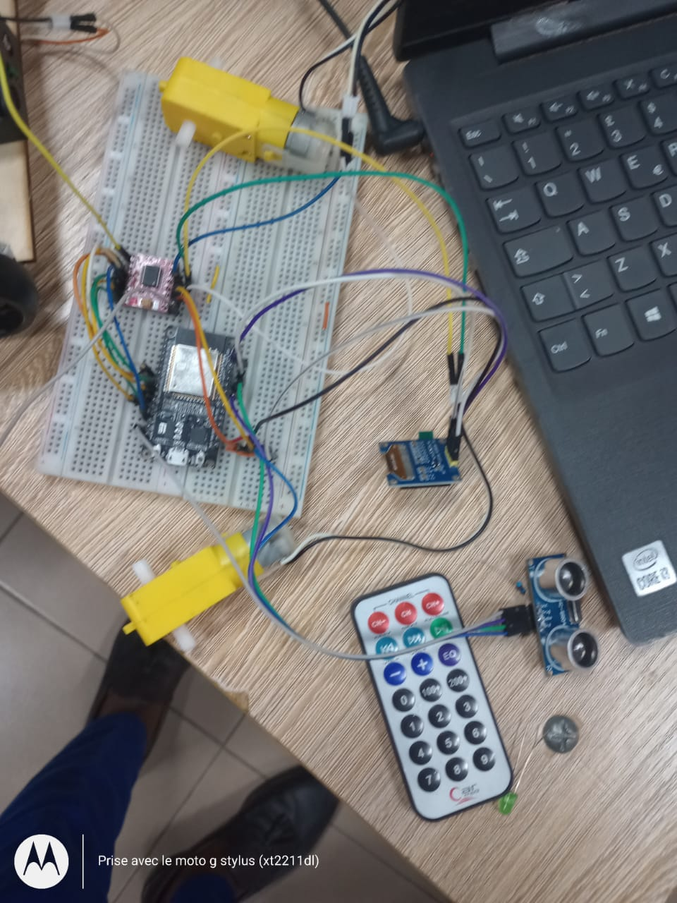
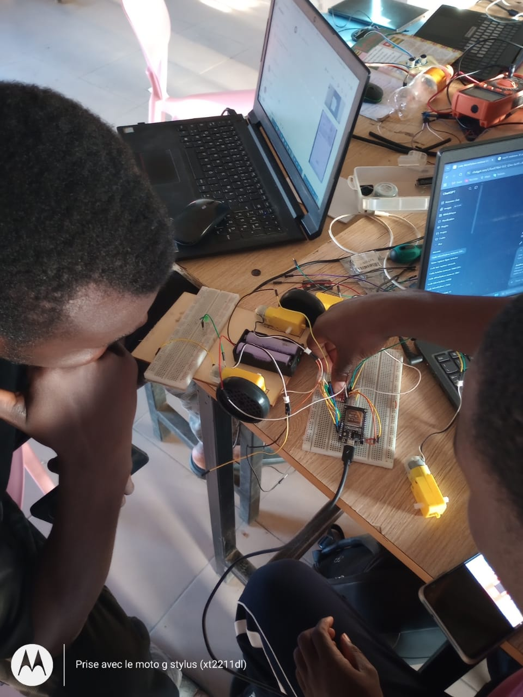
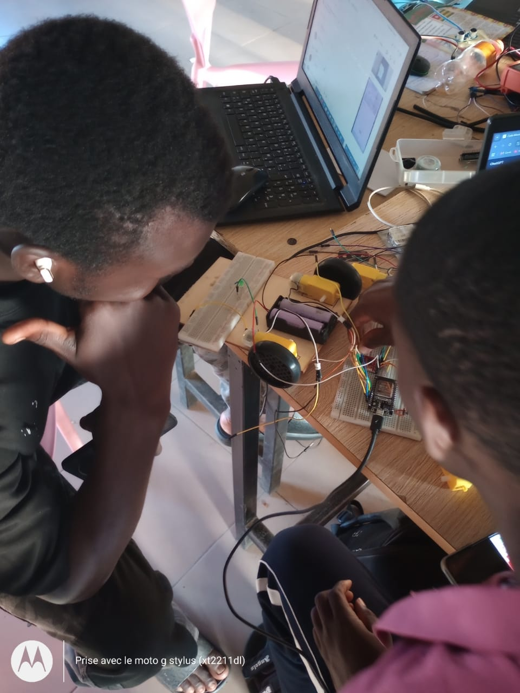
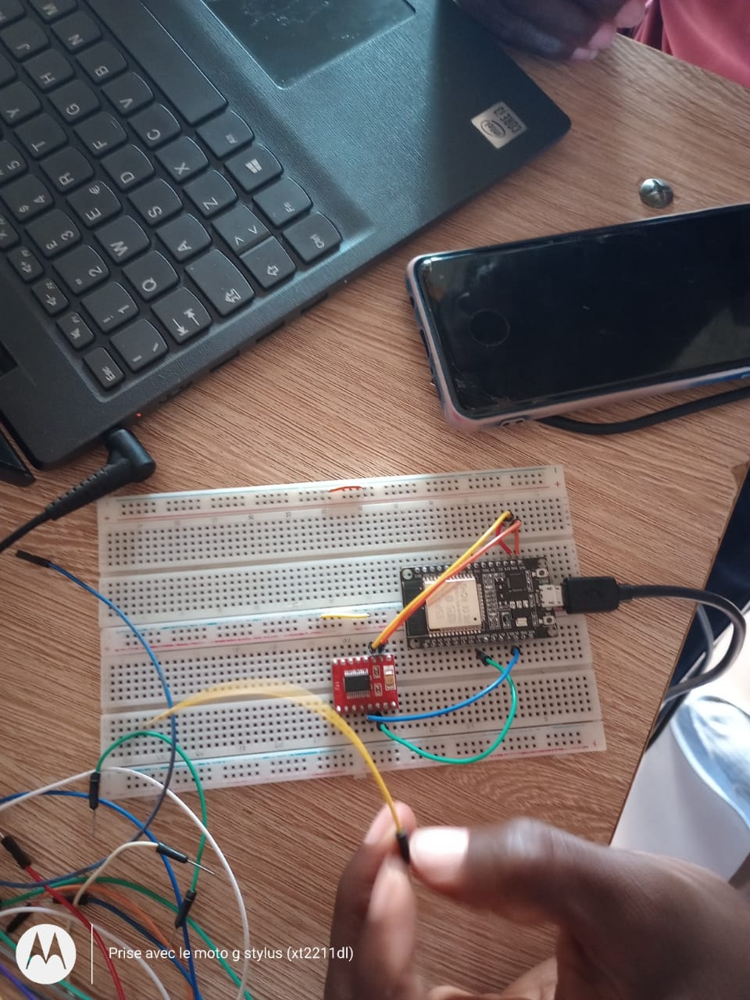

# Journal du Mardi 15 septembre 2026 — TAKARA Appolinaire Assankim
**Rédiger parTAKARA Appolinaire Assankim**

---

## Aujourd'hui

Le formateur a annoncé l'interdiction totale d'utiliser l'Arduino, quel que soit son type, dans notre montage. Nous devions basculer entièrement sur ESP32 et reprendre le câblage depuis zéro. Nous avons reçu un ESP32 NodeMCU pour ce nouveau départ.

---

## Appris

Lors du tout premier branchement, la carte a commencé à chauffer anormalement. Impossible de savoir si elle était défectueuse à la réception ou si l'erreur venait de notre câblage. Nous avons dû demander un remplacement, obtenu vers 16h.

Une fois le nouveau ESP32 en main, voici les branchements que nous avons retenus :

**Écran OLED → ESP32 NodeMCU-30**

**Capteur HC-SR04 → ESP32**

**Driver moteur TB6612FNG → ESP32 NodeMCU-30**

**Alimentation des moteurs**

Voici le montage général une fois assemblé sur la breadboard, avec les deux moteurs, l'écran OLED, le capteur ultrason et la télécommande infrarouge à proximité :

J'ai pu tester les moteurs (gauche/droit, marche avant/arrière) avec un code de test en MicroPython, écrit et exécuté via Thonny :

Le test a fonctionné : les deux moteurs répondent correctement en avant et en arrière, individuellement puis simultanément.

Ensuite, l'ajout du capteur ultrason a montré un comportement clair : moteurs en marche normale sans obstacle, marche arrière dès qu'un obstacle (ma main) s'approche. L'écran OLED nous a permis de visualiser la distance mesurée et de confirmer que le seuil de déclenchement de la marche arrière est de 10 cm.

---

## Raté & corrigé

Erreur commise : nous n'avons pas testé le nouvel ESP32 individuellement avant de l'intégrer directement au montage complet, ce qui ne nous a pas permis d'isoler la cause de la surchauffe.

Correction pour la suite : systématiser le test unitaire de chaque nouveau composant avant intégration, comme ci-dessous où l'ESP32 est testé seul avec un petit module avant d'être remonté dans le circuit complet.

---

## Décidé

Après plusieurs échecs répétés avec les capteurs suiveurs de ligne, nous avons décidé d'abandonner la fonctionnalité "suivi de ligne" prévue au départ. Le projet évolue vers un véhicule pilotable par une commande.

---

## Demain

Ajouter un capteur/module permettant de commander le véhicule à distance.
