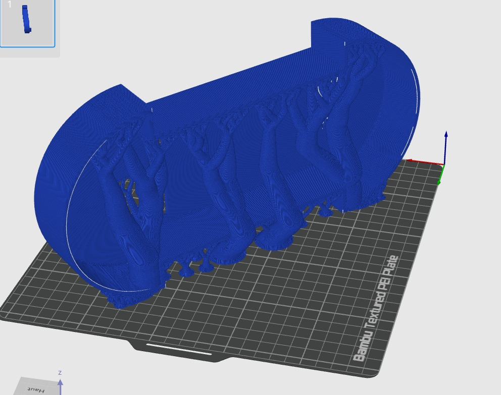
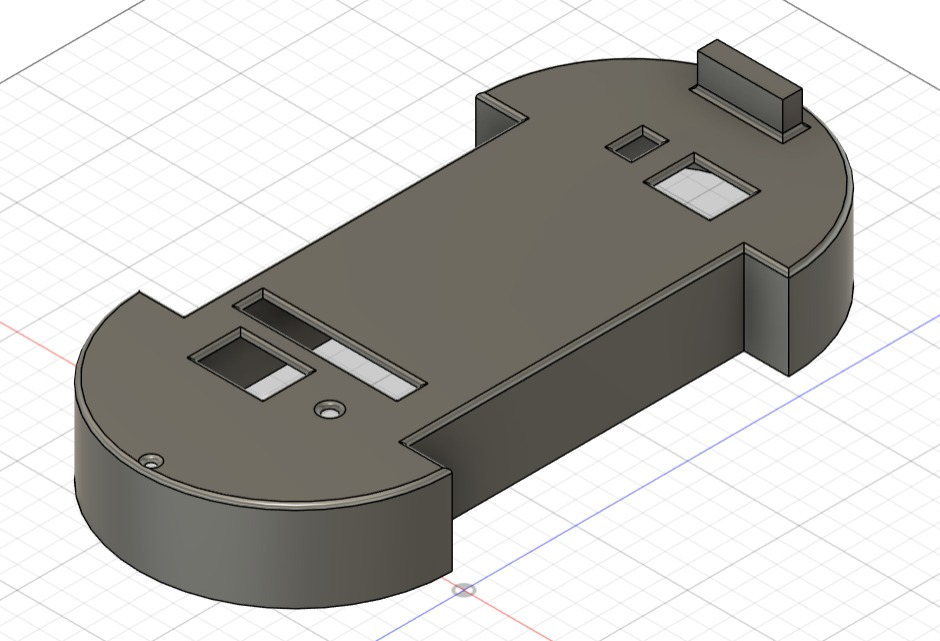
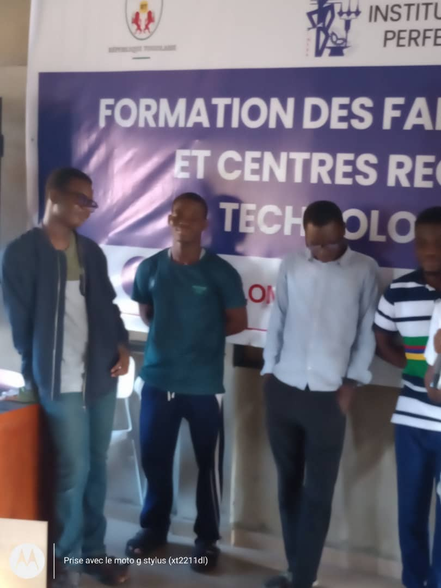
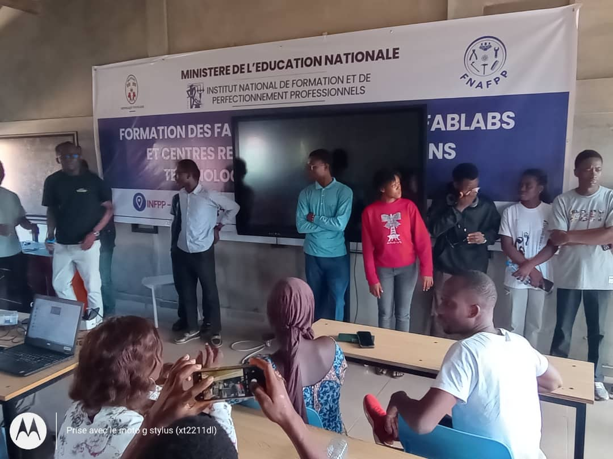
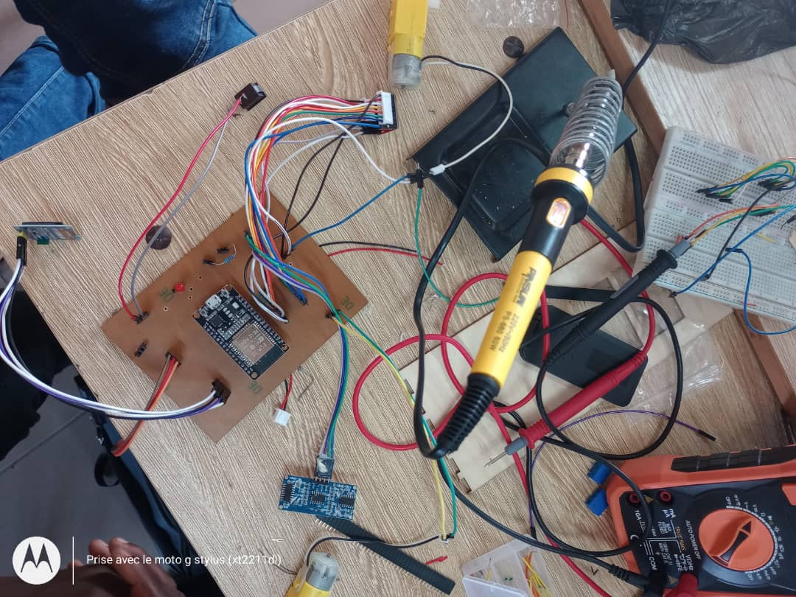
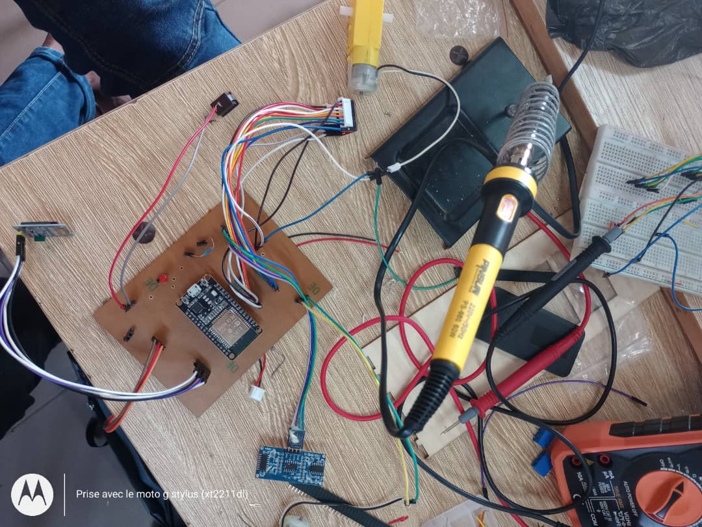

# Journal du 17 Septembre 2026

**Rédigé par :** TAKARA Appolinaire Assankim

**Projet :** Robot Éducatif programmable — Équipe 20

---

## 🛠️ Fait aujourd'hui

- Perçage du PCB imprimé
- Réalisation du montage des composants, puis soudure des composants aux emplacements prévus
- Reconstitution de notre châssis, suite à l'échec de sa conception sur imprimante 3D pendant la nuit
- Montage des roues et des différents éléments pour la reconstitution du robot
- Câblage des composants sur notre PCB et relance de notre boîtier
- Test du montage de notre dispositif
- Présentation du dérouleùment de notre soutenance par le formateur .

---

## 📚 Appris

- Comment percer notre PCB après sa conception
- Comment souder les composants sur un PCB
- Utilisation de la plaque perforée
- La conception du châssis à la découpe laser, ainsi que la façon de visser les composants sur celui-ci
- La soudure des composants sur la plaquette perforée
- Le montage du robot éducatif programmable

---

## ⚠️ Raté et corrigé

**Raté :**
Le PCB imprimé et câblé n'a pas fonctionné, car la pile alimentait à la fois notre ESP32 NodeMCU-30 et le reste du circuit, alors qu'elle ne devait alimenter que le circuit et non l'ESP32.

**Corrigé :**
Réalisation du montage électronique sur la plaquette perforée, ce qui a permis de réussir l'alimentation de notre robot.

---
**A faire demain**
Soutenance dévant un jury + présentation de nos projet de groupe.

## 🙏 Remerciements

Je vous remercie.

---
