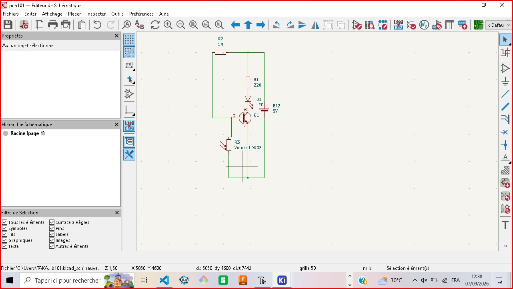
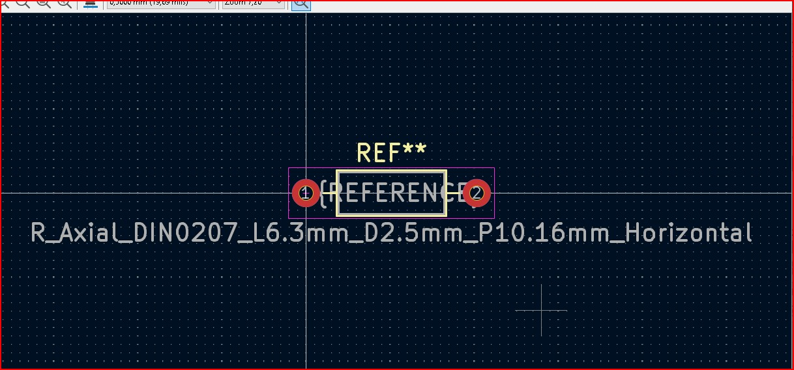
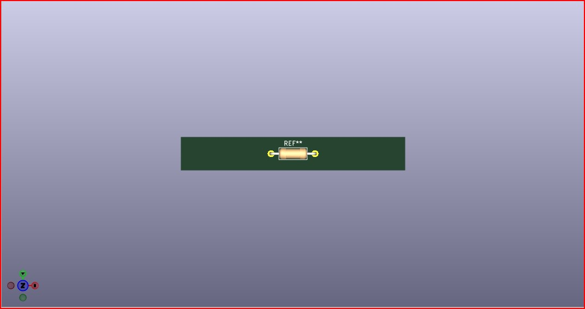
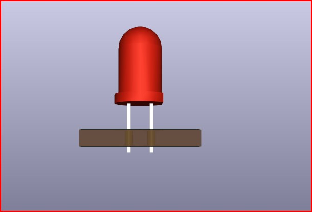
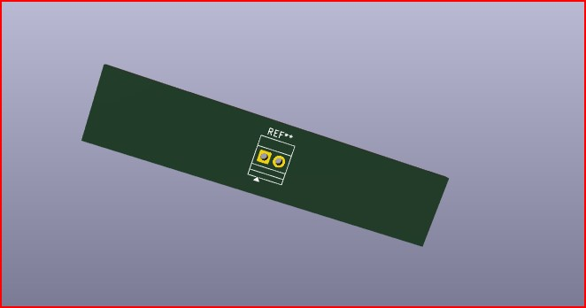
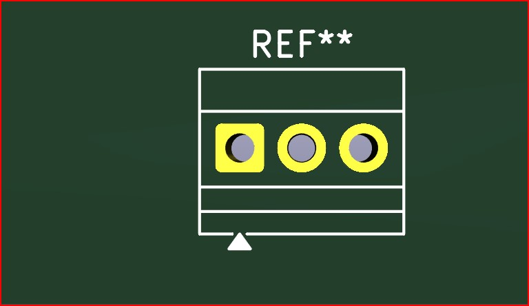
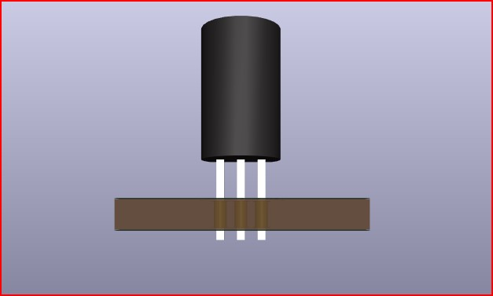
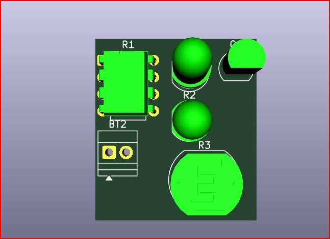

JOURNAL DU 25 AOUT 2026

# 1. Fait aujourd'hui
-Cours d'initiation au PCB.
 

## 2. Appris
- pourquoi passer du prototype au PCB?
- Anatomie d'unPCB.
- De l'idée au schéma
- Du schéma à la mise à jour.
-Editer le PCB kicad
## 3. Raté puis corrigé
-Deux erreurs lors de la mise à jour,battery non connecter,correction et sa marche.
- Un avertissement du à une connection mal faite.

## 4. Décidé
- Faire toujours le schema du circuit et prendre soin de faire la mise à jour pour detecter les différentes erreurs et avertissements.

## 5. À faire demain
- Continuer avec la découverte des différentes options de la kicad.

         Fait,à lomé le 07/09/2026

                TAKARA Appolinaire
