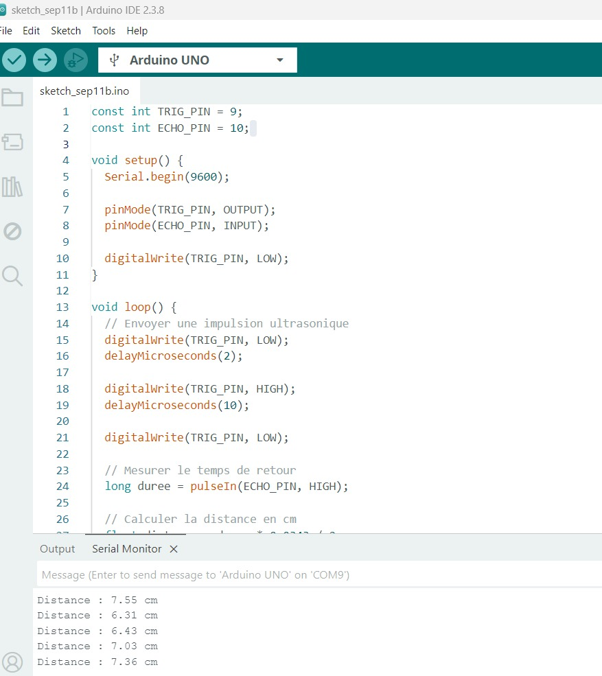
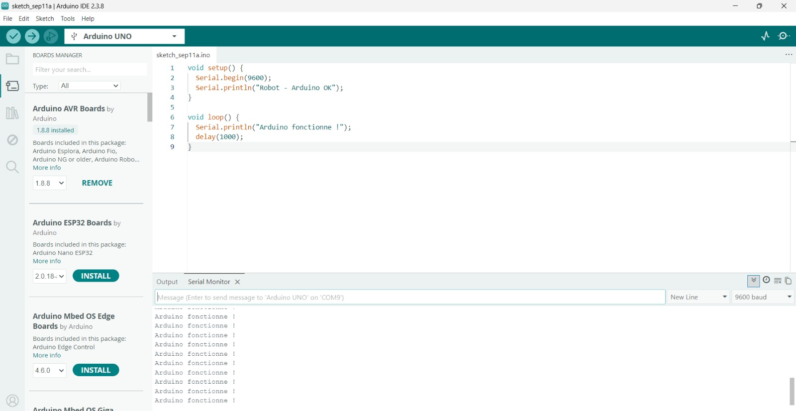
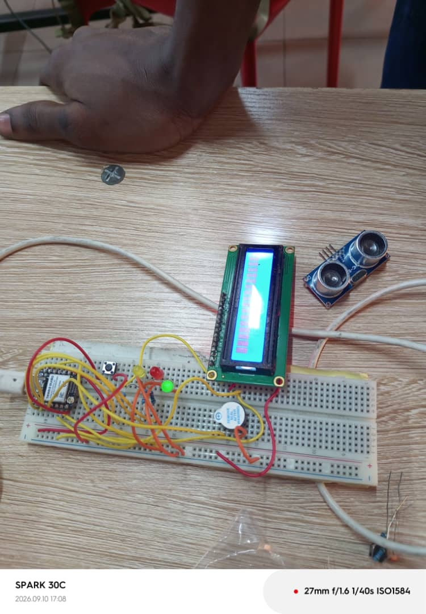

# JOURNAL DU 11 SEPTEMBRE 2026

**Rédigé par TAKARA Appolinaire Assankim**

## 1. Fait aujourd'hui

- Focus complet sur le projet Robot Éducatif.
- Test individuel de tous les composants disponibles : écran OLED, 2 moteurs, driver moteur, capteur ultrason, suiveur de ligne, ESP32-S3.
- Premiers tests réalisés sur ESP32-S3.
- Bascule sur Arduino (Arduino UNO) pour poursuivre les tests suite à des problèmes rencontrés sur ESP32-S3.
- Test réussi du capteur ultrason sur Arduino, avec affichage des distances mesurées en direct sur le moniteur série.

## 2. Appris

- L'ESP32-S3 posait des problèmes pour ces tests, contrairement à l'Arduino UNO qui a permis de tester plus facilement le capteur ultrason.

## 3. Raté puis corrigé

- Difficultés rencontrées avec l'ESP32-S3 lors des tests → correction en basculant sur Arduino UNO pour continuer les tests des composants.

## 4. Décidé

- Continuer les tests avec Arduino UNO pour le moment.
- Passer demain au câblage final du prototype V0 avec l'ensemble des composants.
- Fixer les moteurs sur une planche et tester le déplacement du robot pour vérifier qu'il répond aux exigences attendues.

## 5. À faire demain

- Réaliser le câblage final du prototype V0 (intégration de tous les composants).
- Coller/fixer les moteurs sur la planche support du robot.
- Tester le déplacement du robot sur la planche.
